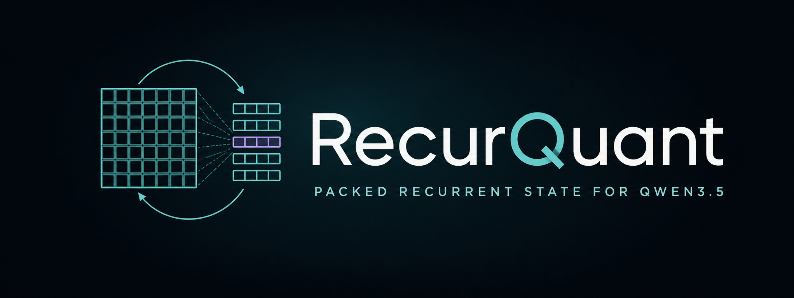
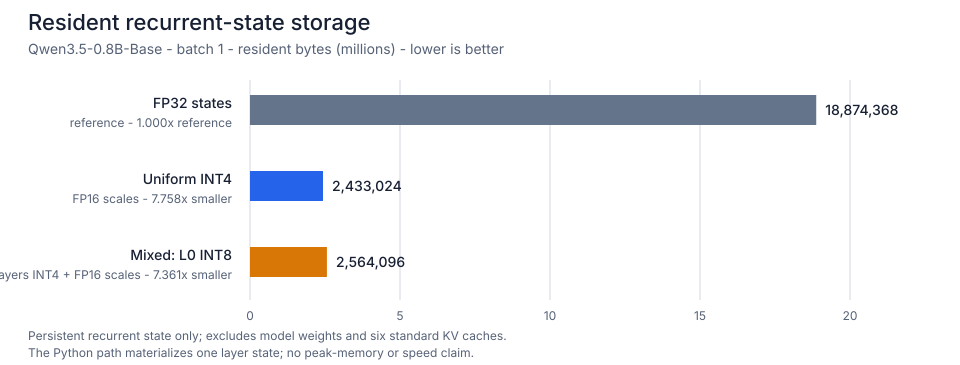
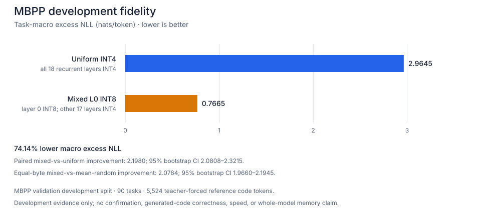

<p align="center">
  
</p>

<p align="center">
  <a href="https://github.com/Labeeb2339/recurquant/actions/workflows/ci.yml"></a>
  <a href="LICENSE"></a>
  
  
  <a href="https://colab.research.google.com/github/Labeeb2339/recurquant/blob/main/notebooks/recurquant_qwen35_colab.ipynb"></a>
</p>

<p align="center">
  <a href="#60-second-setup"><b>Quickstart</b></a> ·
  <a href="#what-is-physically-smaller"><b>Storage</b></a> ·
  <a href="#public-development-evidence"><b>Evidence</b></a> ·
  <a href="docs/compatibility.md"><b>Compatibility</b></a> ·
  <a href="docs/reproducing.md"><b>Reproduce</b></a>
</p>

RecurQuant is an alpha Python package that physically packs the persistent
recurrent matrix states used by Qwen3.5 Gated DeltaNet layers. Pass its cache to
ordinary eager Transformers model calls to keep those states as grouped INT4 or
INT8 payloads between calls.

It currently targets
[`Qwen/Qwen3.5-0.8B-Base`](https://huggingface.co/Qwen/Qwen3.5-0.8B-Base).
RecurQuant does not quantize model weights or ordinary attention KV caches, and
its current Python path dequantizes one recurrent state while that layer runs.

I built and maintain RecurQuant as an open research project. —
[Muhammad Labeeb Aryan](https://github.com/Labeeb2339). Licensed under
[Apache-2.0](LICENSE).

## 60-second setup

The commands are short; the first run still needs to download the pinned model
and tokenizer. Python 3.11 and a CUDA GPU are recommended for the evaluated
path.

Windows PowerShell:

```powershell
git clone --branch v0.2.0a1 --depth 1 https://github.com/Labeeb2339/recurquant.git
cd recurquant
py -3.11 -m venv .venv
.\.venv\Scripts\python.exe -m pip install .
.\.venv\Scripts\recurquant.exe qwen35 --max-new-tokens 16
```

macOS or Linux:

```bash
git clone --branch v0.2.0a1 --depth 1 https://github.com/Labeeb2339/recurquant.git
cd recurquant
python3.11 -m venv .venv
.venv/bin/python -m pip install .
.venv/bin/recurquant qwen35 --max-new-tokens 16
```

To verify the installation without downloading a model, run `recurquant demo`
with the platform-specific executable path above. It performs a deterministic
synthetic state round-trip and reports physical payload bytes, compression
ratio, and quantization error.

The installed command and
[`examples/qwen35_quickstart.py`](examples/qwen35_quickstart.py) call the same
implementation. The default is the frozen v0.2 mixed policy: layer 0 at INT8
and the remaining recurrent layers at INT4. Uniform INT4 is retained only as an
explicit stress baseline via `--policy uniform-int4-stress`. Add `--json` for
one machine-readable result containing the generated text, pinned model
provenance, selected policy, and raw storage counters. Read the
[compatibility contract](docs/compatibility.md) before using a different model,
Transformers version, device layout, or generation mode.

## Use it in Python

This example uses the reusable frozen v0.2 helper, which keeps Gated DeltaNet
layer 0 at INT8 and the other 17 recurrent layers at INT4. The generic
`create_qwen35_packed_cache()` factory remains available for controlled policy
experiments.

```python
import warnings

import torch
from transformers import AutoModelForCausalLM, AutoTokenizer

from recurquant import create_qwen35_v02_mixed_cache

MODEL_ID = "Qwen/Qwen3.5-0.8B-Base"
REVISION = "dc7cdfe2ee4154fa7e30f5b51ca41bfa40174e68"

device = torch.device("cuda" if torch.cuda.is_available() else "cpu")
if device.type != "cuda":
    dtype = torch.float32
elif torch.cuda.is_bf16_supported():
    dtype = torch.bfloat16
else:
    warnings.warn(
        "CUDA BF16 is unavailable; falling back to FP16. RecurQuant's public "
        "full-model fidelity evidence has not been validated for FP16 weights.",
        RuntimeWarning,
        stacklevel=2,
    )
    dtype = torch.float16

tokenizer = AutoTokenizer.from_pretrained(MODEL_ID, revision=REVISION)
model = AutoModelForCausalLM.from_pretrained(
    MODEL_ID,
    revision=REVISION,
    dtype=dtype,
    attn_implementation="eager",
).to(device)
model.eval()

cache = create_qwen35_v02_mixed_cache(model)
inputs = tokenizer("Explain recurrent-state quantization simply.", return_tensors="pt")
inputs = inputs.to(device)
continuation = []

with torch.inference_mode():
    output = model(**inputs, past_key_values=cache, use_cache=True)
    for step in range(32):
        next_token = output.logits[:, -1, :].argmax(dim=-1, keepdim=True)
        continuation.append(next_token)
        reached_eos = (
            tokenizer.eos_token_id is not None
            and bool((next_token == tokenizer.eos_token_id).all().item())
        )
        if reached_eos or step == 31:
            break
        output = model(input_ids=next_token, past_key_values=cache, use_cache=True)

generated_ids = torch.cat(continuation, dim=1)
print(tokenizer.decode(generated_ids[0], skip_special_tokens=True))
print(cache.storage_summary())
```

`create_qwen35_v02_mixed_cache()` and `create_qwen35_packed_cache()` reject
unsupported Transformers versions, non-eager attention, training mode,
multi-device placement, and incompatible Qwen configurations early. The
returned cache exposes exact live tensor byte accounting through
`storage_summary()`.

## What is physically smaller

For batch-one Qwen3.5-0.8B-Base recurrent states, the frozen mixed layout stores
2,564,096 resident bytes instead of 18,874,368 FP32-state bytes. Uniform INT4
stores 2,433,024 bytes. These figures include packed payloads, FP16 group
scales, and padding.



This is recurrent-state storage only. It is not a whole-model, peak-CUDA-memory,
latency, or throughput result.

## Public development evidence

On the pinned MBPP validation development split, task-macro excess negative
log-likelihood above the FP32-state reference fell from `2.964469` for uniform
INT4 to `0.766489` for the mixed layer-0 layout: a **74.14% reduction versus
uniform INT4**.



The evidence covers 90 paired tasks and 5,524 teacher-forced reference-code
tokens. The paired mixed-versus-uniform improvement was `2.1980` nats/token
with a 95% bootstrap interval of `[2.0808, 2.3215]`. Against the mean of three
equal-byte random high-precision layer placements, the paired improvement was
`2.0784` with a 95% interval of `[1.9660, 2.1945]`.

Important boundaries:

- This is a **development** result from
  [`evidence/mbpp-v02-development.json`](evidence/mbpp-v02-development.json),
  not an untouched confirmation result.
- Tokens were scored teacher-forced. Candidate-generated code was not fed back,
  executed, or graded for correctness.
- The MSE selector also chose layer 0, so its candidate is exactly the same
  layout and result—not an independent replication.
- The result supports a recurrent-state fidelity claim only. It does not support
  generated-code quality, speed, or whole-model memory claims.

## Scope

The supported public surface is deliberately narrow:

- Python `>=3.11` and exactly `transformers==5.14.1` for this alpha;
- text-only Qwen3.5 hybrid models with `linear_attention` and `full_attention`
  layer types;
- physical INT4 or INT8 recurrent-state payloads; FP16 scales are the evaluated
  default, while FP32 scales are supported as an experimental, unevaluated
  option;
- eager, evaluation-only, single-device inference; and
- explicit `past_key_values=cache` model calls.

See [`docs/compatibility.md`](docs/compatibility.md) for the validated software,
hardware, model revision, generation paths, and unsupported modes.

## Claim boundary

Quantizing recurrent state is not new. I built RecurQuant to test one narrower
question: can sensitivity-guided mixed precision preserve Gated DeltaNet
recurrent-state fidelity better than simple equal-byte placements? The current
public result is development-only, so I am not presenting it as a breakthrough,
a speedup, a whole-model memory reduction, or a confirmed finding.

The development result passed the frozen continuation gates. The untouched
confirmation remains separate until its result is complete and public.

## Research record

- Validate any evidence file offline with `recurquant verify-artifact`; the
  [reproduction guide](docs/reproducing.md) includes exact committed hashes and
  a CI-friendly command.
- [Frozen public evaluation protocol](research/PUBLIC_EVAL_PROTOCOL_V02.md)
- [MBPP development report](research/DEVELOPMENT_002.md)
- [Earlier research-status snapshot](research/STATUS.md)
- [Claim boundary](research/CLAIM_BOUNDARY.md) and
  [prior-art review](research/PRIOR_ART.md)
- [Failed proxy signals and empirical-sensitivity pivot](research/EXPERIMENT_001_SIGNAL_PIVOT.md)
- [Scale-format correction and packed/QDQ parity](research/EXPERIMENT_002_SCALE_CORRECTION.md)
- [Earlier pilot protocol](research/PILOT_PROTOCOL.md) and
  [v0.1 diagnostic confirmation archive](research/CONFIRMATION_001.md)

## Contributing

I welcome reproducible compatibility reports, additional model-family adapters,
and work toward a fused packed recurrent kernel. Open an
[issue](https://github.com/Labeeb2339/recurquant/issues) with a minimal
reproducer and `cache.storage_summary()`; never include access tokens, private
prompts, or authentication files.
