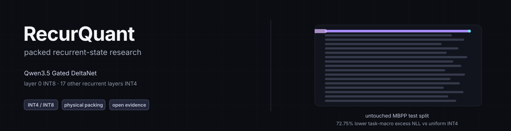
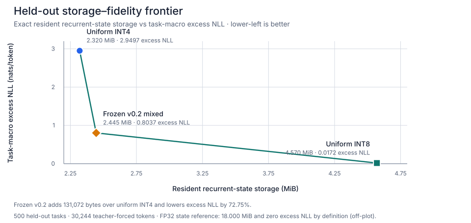
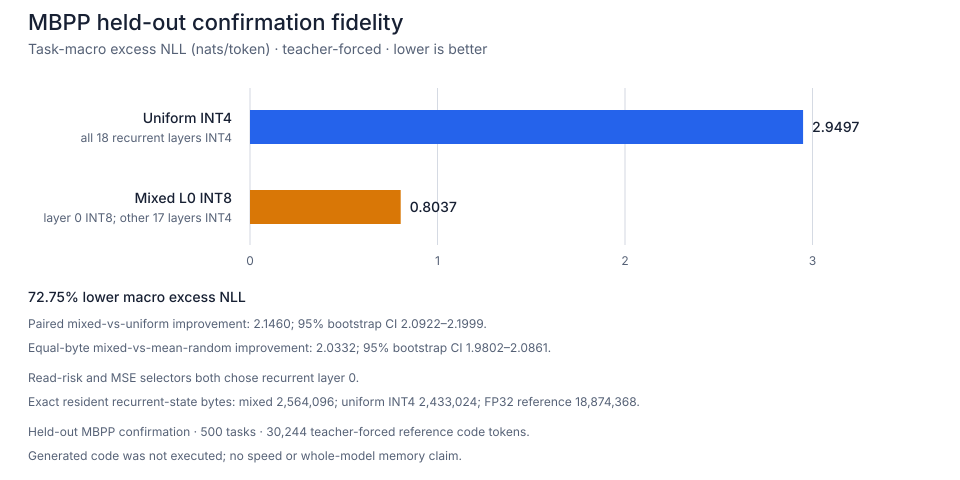
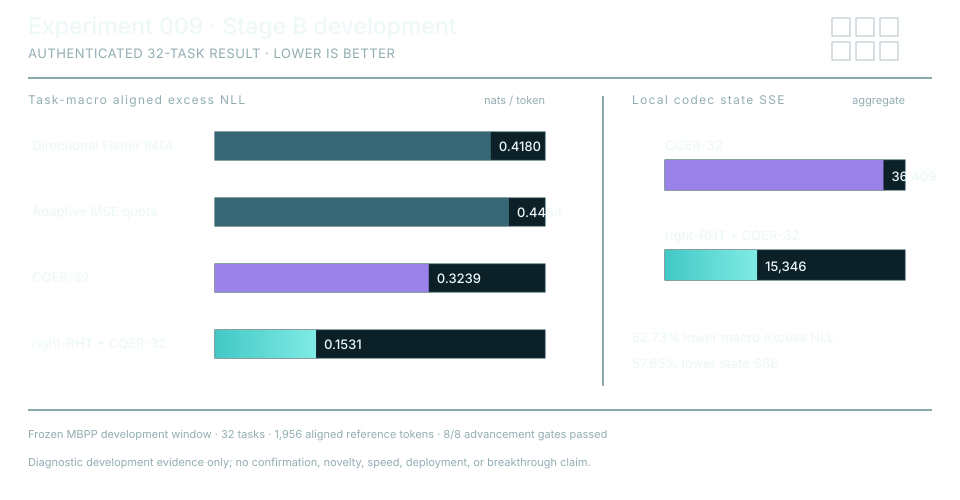
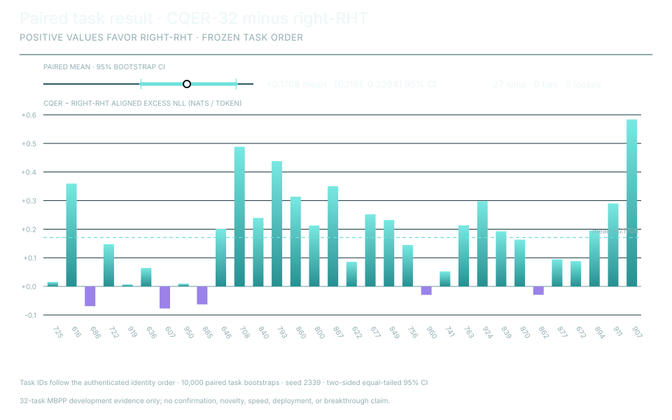

<p align="center">
  
</p>

<p align="center">
  <a href="https://github.com/Labeeb2339/recurquant/actions/workflows/ci.yml"></a>
  <a href="LICENSE"></a>
  
  
  <a href="https://colab.research.google.com/github/Labeeb2339/recurquant/blob/main/notebooks/recurquant_qwen35_colab.ipynb"></a>
</p>

<p align="center">
  <a href="#quickstart"><b>Quickstart</b></a> |
  <a href="#the-trade-off"><b>Trade-off</b></a> |
  <a href="#what-is-physically-smaller"><b>Storage</b></a> |
  <a href="#held-out-result"><b>v0.2 evidence</b></a> |
  <a href="#experiment-009-rht-cqer-32"><b>Stage B</b></a> |
  <a href="#experiment-012-statelease-h5"><b>StateLease-H5</b></a> |
  <a href="docs/compatibility.md"><b>Compatibility</b></a> |
  <a href="docs/reproducing.md"><b>Reproduce</b></a>
</p>

RecurQuant quantizes the recurrent-state path of Qwen3.5's Gated DeltaNet — not
the weights, not the attention KV cache — and measures how much token-level
quality survives at a fixed byte budget.

It doesn't touch model weights, and it runs the normal eager Transformers
forward with a pluggable cache, so each experiment stays easy to reproduce.

The v0.2 layout passed a 500-task held-out MBPP teacher-forcing evaluation.
Compared with uniform INT4, mean excess NLL across tasks was 72.75% lower, at a
packed recurrent-state footprint of `2,564,096` bytes (packed payloads plus
FP16 scales).

An experimental v0.3 path, RHT-CQER-32, cleared a separate 32-task development
test: its aligned excess NLL was 52.73% lower than CQER-32 at the same
packed-state and selector-byte budget. That result is development-only.

The target model is
[`Qwen/Qwen3.5-0.8B-Base`](https://huggingface.co/Qwen/Qwen3.5-0.8B-Base).
Model weights and standard attention KV caches are not quantized, and the
current Python implementation still dequantizes one recurrent state during the
forward pass.

Built and maintained by
[Muhammad Labeeb Aryan](https://github.com/Labeeb2339). Licensed under
[Apache-2.0](LICENSE).

## The trade-off

Of the nearest-rounding layouts I tested, three sit on the storage-fidelity
frontier. Each spends more resident recurrent-state storage for lower
teacher-forced excess NLL. The v0.2 layout is the middle point: `131,072` bytes
(`5.39%`) more than uniform INT4, for 72.75% lower mean excess NLL.



The chart is generated from the committed
[500-task results file](evidence/mbpp-v02-confirmation.json), and CI rejects
stale assets. It compares exact resident recurrent-state bytes against
teacher-forced fidelity only. The matched FP32 reference sits off-plot at
`18,874,368` bytes and zero excess NLL by definition. These are not speed,
peak-memory, whole-model-memory, or generated-code numbers.

## Quickstart

This installs the public v0.2 alpha from its tag. The first model-backed run
downloads the pinned model and tokenizer; `recurquant demo` uses synthetic
states and downloads nothing. Python 3.11 and a CUDA GPU match the evaluated
path. RHT-CQER-32 stays an experimental path, not the default.

Windows PowerShell:

```powershell
git clone --branch v0.2.0a1 --depth 1 https://github.com/Labeeb2339/recurquant.git
cd recurquant
py -3.11 -m venv .venv
.\.venv\Scripts\python.exe -m pip install .
.\.venv\Scripts\recurquant.exe qwen35 --max-new-tokens 16
```

macOS or Linux:

```bash
git clone --branch v0.2.0a1 --depth 1 https://github.com/Labeeb2339/recurquant.git
cd recurquant
python3.11 -m venv .venv
.venv/bin/python -m pip install .
.venv/bin/recurquant qwen35 --max-new-tokens 16
```

`recurquant demo` does a deterministic synthetic state round-trip and reports
physical payload bytes, compression ratio, and quantization error.

The installed command and
[`examples/qwen35_quickstart.py`](examples/qwen35_quickstart.py) call the same
implementation. The default policy keeps layer 0 at INT8 and the other 17
recurrent layers at INT4; uniform INT4 is available as a stress baseline via
`--policy uniform-int4-stress`. `--json` prints one machine-readable result
with generated text, model provenance, policy, and raw storage counters. Read
[`docs/compatibility.md`](docs/compatibility.md) before changing model,
Transformers version, device layout, or generation mode.

## Use it in Python

The `create_qwen35_v02_mixed_cache()` helper keeps Gated DeltaNet layer 0 at
INT8 and the rest at INT4. The generic `create_qwen35_packed_cache()` factory
is there for controlled policy experiments.

```python
import warnings

import torch
from transformers import AutoModelForCausalLM, AutoTokenizer

from recurquant import create_qwen35_v02_mixed_cache

MODEL_ID = "Qwen/Qwen3.5-0.8B-Base"
REVISION = "dc7cdfe2ee4154fa7e30f5b51ca41bfa40174e68"

device = torch.device("cuda" if torch.cuda.is_available() else "cpu")
if device.type != "cuda":
    dtype = torch.float32
elif torch.cuda.is_bf16_supported():
    dtype = torch.bfloat16
else:
    warnings.warn(
        "CUDA BF16 unavailable; falling back to FP16 (fidelity evidence not "
        "validated for FP16 weights).",
        RuntimeWarning,
        stacklevel=2,
    )
    dtype = torch.float16

tokenizer = AutoTokenizer.from_pretrained(MODEL_ID, revision=REVISION)
model = AutoModelForCausalLM.from_pretrained(
    MODEL_ID,
    revision=REVISION,
    dtype=dtype,
    attn_implementation="eager",
).to(device)
model.eval()

cache = create_qwen35_v02_mixed_cache(model)
inputs = tokenizer("Explain recurrent-state quantization simply.", return_tensors="pt")
inputs = inputs.to(device)
continuation = []

with torch.inference_mode():
    output = model(**inputs, past_key_values=cache, use_cache=True)
    for step in range(32):
        next_token = output.logits[:, -1, :].argmax(dim=-1, keepdim=True)
        continuation.append(next_token)
        reached_eos = (
            tokenizer.eos_token_id is not None
            and bool((next_token == tokenizer.eos_token_id).all().item())
        )
        if reached_eos or step == 31:
            break
        output = model(input_ids=next_token, past_key_values=cache, use_cache=True)

generated_ids = torch.cat(continuation, dim=1)
print(tokenizer.decode(generated_ids[0], skip_special_tokens=True))
print(cache.storage_summary())
```

Both cache factories reject unsupported Transformers versions, non-eager
attention, training mode, multi-device placement, and incompatible Qwen configs
early. `storage_summary()` reports exact live tensor bytes.

## What is physically smaller

For batch-one Qwen3.5-0.8B-Base recurrent states, the mixed layout stores
2,564,096 resident bytes instead of 18,874,368 FP32-state bytes; uniform INT4
stores 2,433,024. These figures include packed payloads, FP16 group scales, and
padding.


This is recurrent-state storage only — not whole-model, peak-CUDA-memory,
latency, or throughput.

## Held-out result

The layer-0-at-INT8 layout passed every v0.2 quality and integrity check on the
untouched MBPP test split. Mean excess NLL above the FP32 reference fell from
`2.949743` (uniform INT4) to `0.803713`: a **72.75% reduction**.



The run covers 500 paired tasks and 30,244 teacher-forced reference-code
tokens. The paired mixed-vs-uniform improvement was `2.1460` nats/token with a
95% bootstrap interval of `[2.0922, 2.1999]`. Against the mean of three
same-byte random high-precision layer placements, it was `2.0332` with a 95%
interval of `[1.9802, 2.0861]`.

| Token-weighted measure | Uniform INT4 | Mixed L0 INT8 |
|---|---:|---:|
| Mean KL | 3.149969 | 0.914580 |
| Worst-5% KL | 9.002207 | 4.839139 |
| Top-1 agreement | 0.321155 | 0.665190 |

The earlier 90-task development result was a 74.14% reduction; it's still in
[`evidence/mbpp-v02-development.json`](evidence/mbpp-v02-development.json) and
[`DEVELOPMENT_002.md`](research/DEVELOPMENT_002.md).

Caveats:

- The accepted result is in
  [`evidence/mbpp-v02-confirmation.json`](evidence/mbpp-v02-confirmation.json),
  with the full decision and interruption record in
  [`CONFIRMATION_002.md`](research/CONFIRMATION_002.md).
- Tokens were scored teacher-forced. Candidate-generated code was not fed back,
  executed, or graded for correctness.
- The MSE selector also chose layer 0, so it's the same candidate and not
  independent evidence that the read-risk selector is better.
- This supports one pinned recurrent-state fidelity and resident-byte result —
  not generated-code quality, speed, peak memory, whole-model memory,
  cross-model generality, or any novelty claim.

## Experiment 009: RHT-CQER-32

RHT-CQER-32 applies a deterministic right-side randomized Hadamard transform
inside each recurrent-state row group, before the same Q4/Q8 packing CQER-32
uses. The transform doesn't change the 1,976-row precision allocation or
storage contract: both use 2,564,096 packed state bytes and 2,711,552 resident
bytes including the query-energy selector.

On the 32-task ranked MBPP `[32, 64)` development window, RHT-CQER-32 passed
all eight pre-set checks. Mean aligned excess NLL fell from `0.323944` to
`0.153129`, a **52.73% reduction**; aggregate local recurrent-state
reconstruction SSE fell from `36,409.363073` to `15,345.844948`, a **57.85%
reduction**.



RHT-CQER-32 had lower excess NLL on 27 of 32 tasks (no ties). The paired
CQER-minus-RHT improvement was `0.170815` nats/token, with a 10,000-sample
paired 95% bootstrap interval of `[0.116082, 0.229438]`.



This is positive development evidence on one pinned model and task window, not
a held-out result for RHT-CQER-32. Randomized Hadamard and rotation
quantization are prior art, and the current Python implementation has no fused
kernel, latency, peak-memory, cross-model, or external-reproduction result. See
the [full Stage-B result](research/EXPERIMENT_009_STAGE_B_RESULT.md),
[verification log](research/EXPERIMENT_009_STAGE_B_VERIFICATION_RECEIPT.md), and
[machine-readable release manifest](evidence/experiment009-rht-cqer-stage-b-result-manifest.json).

## Experiment 012: StateLease-H5

StateLease-H5 passed all eight pre-set Stage-A screening checks on one
previously opened MBPP calibration task (38 scored tokens). At `3,454,664`
allocated resident bytes, its excess NLL was `0.023349` versus `0.028442` for
the strongest fixed-replay schedule (`fixed_cut4_in5`) — a descriptive `17.90%`
reduction on this one trace.

It did **not** beat the two strongest equal-total-byte no-replay codecs: the
Q4/Q6/Q8 comparator reached `-0.000014` excess NLL and expanded Q4/Q8 reached
`0.002461`. So this is a screening pass, not a development, held-out,
general-advantage, or novelty result.


The [full Stage-A record](evidence/experiment012-statelease-stage-a-666.json)
is committed with file SHA-256
`1e92b0bea176154496c7d5e45013bf051ef3f388352c1267d86910f81844fd22`. The
verifier was added after `v0.2.0a1` and isn't in that tag; install the current
`main` branch in a separate checkout to run it:

```bash
git clone --branch main --depth 1 https://github.com/Labeeb2339/recurquant.git recurquant-statelease
cd recurquant-statelease
python -m pip install .
recurquant verify-statelease-stage-a evidence/experiment012-statelease-stage-a-666.json
```

This recomputes the metrics, storage contracts, and eight gate decisions
offline. See the [result note](research/EXPERIMENT_012_STAGE_A_RESULT.md) for
the full method table, storage breakdown, gate outcomes, and limits.

The current `main` branch can also run that exact frozen StateLease-H5 row plan
through the pinned model as an interactive smoke test:

```bash
recurquant qwen35 --policy statelease-h5 --device auto --max-new-tokens 16
```

This path reconstructs and authenticates all 1,976 promoted row identities,
attaches the causal `Qwen35StateLeaseObserver` for the complete forward loop,
and reports the full `3,454,664`-byte resident footprint: packed checkpoint
(including its precision mask), query EMA, and replay capacity. It is a batch-one eager
correctness/demo path. Its output is not new Experiment 012 or Stage-B evidence,
and it does not support a fused-kernel, latency, peak-memory, or breakthrough
claim.

## Scope

The supported public surface is deliberately narrow:

- Python `>=3.11` and exactly `transformers==5.14.1` for this alpha;
- text-only Qwen3.5 hybrid models with `linear_attention` and `full_attention`
  layer types;
- physical INT4 or INT8 recurrent-state payloads; FP16 scales are the evaluated
  default, FP32 scales an experimental, unevaluated option;
- eager, evaluation-only, single-device inference; and
- explicit `past_key_values=cache` model calls.

See [`docs/compatibility.md`](docs/compatibility.md) for the validated software,
hardware, model revision, generation paths, and unsupported modes.

## What this does and doesn't claim

Quantizing recurrent state isn't new. The question here is narrower: does
sensitivity-guided mixed precision keep Gated DeltaNet recurrent-state fidelity
better than equal-byte placements? On the pinned Qwen3.5-0.8B-Base
teacher-forced MBPP evaluation, the v0.2 policy passed the held-out test and
beat all three same-byte random placements.

That's one measured case study, not proof of novelty or general superiority.
Q-Mamba already studies 4-bit persistent Mamba2 states, Quamba2 quantizes
cached SSM states, SGLang compresses idle Mamba/GDN prefix checkpoints to INT8,
and other mixed-precision, replay, and fused GDN systems overlap parts of this
design space. Experiment 009 adds a positive 32-task development result for a
known right-RHT codec composed with CQER-32 — it isn't a new confirmation or
evidence that Hadamard quantization is new. RecurQuant has no fused packed
StateLease kernel or measured speed claim. So I don't present it as a
breakthrough, a whole-model memory reduction, or a cross-model result. See the
[limits note](research/CLAIM_BOUNDARY.md) and
[prior-art review](research/PRIOR_ART.md) for the exact comparison.

## Research record

- Re-run the held-out decision with `recurquant verify-confirmation`; the
  [reproduction guide](docs/reproducing.md) pins committed hashes and explains
  optional raw-checkpoint reconstruction.
- [Held-out MBPP report](research/CONFIRMATION_002.md) and
  [machine-readable evidence](evidence/mbpp-v02-confirmation.json)
- [Public evaluation protocol](research/PUBLIC_EVAL_PROTOCOL_V02.md)
- [MBPP development report](research/DEVELOPMENT_002.md)
- [Current status](research/STATUS.md)
- [CORA-C2 development result](research/EXPERIMENT_008_RESULT.md)
- [Experiment 009 protocol](research/EXPERIMENT_009_RHT_CQER_PROTOCOL.md)
- [Experiment 009 Stage-A result](research/EXPERIMENT_009_STAGE_A_RESULT.md)
- [Experiment 012 StateLease-H5 Stage-A result](research/EXPERIMENT_012_STAGE_A_RESULT.md)
- [Experiment 009 Stage-B identity freeze](research/EXPERIMENT_009_STAGE_B_IDENTITY.md)
- [Experiment 009 Stage-B result](research/EXPERIMENT_009_STAGE_B_RESULT.md)
- [Experiment 009 verification log](research/EXPERIMENT_009_STAGE_B_VERIFICATION_RECEIPT.md)
- [Experiment 009 release manifest](evidence/experiment009-rht-cqer-stage-b-result-manifest.json)
- [Limits](research/CLAIM_BOUNDARY.md) and
  [prior-art review](research/PRIOR_ART.md)
- [Failed proxy signals and sensitivity pivot](research/EXPERIMENT_001_SIGNAL_PIVOT.md)
- [Scale-format correction and packed/QDQ parity](research/EXPERIMENT_002_SCALE_CORRECTION.md)
- [Earlier pilot protocol](research/PILOT_PROTOCOL.md) and
  [v0.1 diagnostic archive](research/CONFIRMATION_001.md)

## Contributing

Reproducible compatibility reports, model-family adapters, and work toward a
fused packed recurrent kernel are all welcome. Open an
[issue](https://github.com/Labeeb2339/recurquant/issues) with a minimal
reproducer and `cache.storage_summary()`; don't include access tokens, private
prompts, or authentication files.
