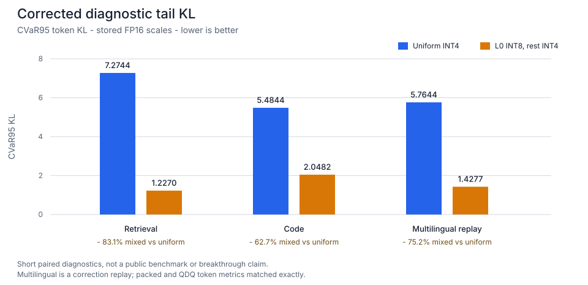

# RecurQuant

<p align="center">
  
</p>

I built RecurQuant as a constrained systems-research project:
keep recurrent state packed as long as possible, keep claims auditable,
and keep every result reproducible.

**Current status:** On **Qwen3.5-0.8B-Base**, the frozen mixed layout uses
`2,564,096` recurrent-state bytes versus `18,874,368` FP32-state bytes.
This is a recurrent-state-only result; the Python path still materializes one
state while its layer executes.


After fixing the v0.1 FP16 scale-correction issue, retaining layer 0 as INT8 and
all other recurrent rows at INT4 reduced worst-5% token KL by:

- 83.1% on retrieval
- 62.7% on code
- 75.2% on multilingual correction replay

against uniform INT4 in short diagnostics.



These are short checks, not a public benchmark. The frozen public-eval gate is the
[MBPP confirmation](research/CONFIRMATION_002.md).

## Research question

Can sub-8-bit recurrent-state storage in Gated DeltaNet allocate more precision
where it reduces future-read error most, with the same byte budget?

[Qwen3.5-0.8B-Base](https://huggingface.co/Qwen/Qwen3.5-0.8B-Base) is the first
target. Its recurrent stack has 18 states across 18 linear-attention layers.

## What this repository measures

- Deterministic grouped INT4, INT6, and INT8 state round trips.
- Physical INT4 nibble packing and INT8 payload storage with FP16/FP32 scales.
- A transformers cache that keeps Gated DeltaNet recurrent state packed between calls.
- Per-layer state size and error.
- Paired token-level KL divergence and top-1 agreement against an FP32-state run.
- Tail error, not only average perplexity.
- State-update magnitude for later sensitivity analysis.
- Query-weighted recurrent-read error (`q^T S`) as a proxy for impact.
- Exact resident payload and scale bytes, including group-padding overhead.

The implementation targets **recurrent-state compression only**. It still
materializes one state for the unmodified kernel, so this project does not yet
claim lower peak CUDA memory or faster inference. A fused recurrent kernel is the
next systems milestone.

## Use the packed cache

```python
from recurquant import PackedRecurrentStateCache, QuantizationSpec

cache = PackedRecurrentStateCache(
    model.config,
    spec=QuantizationSpec(bits=4, group_size=128),
    layer_specs={0: QuantizationSpec(bits=8, group_size=128)},
)
output = model(input_ids, past_key_values=cache, use_cache=True)
print(cache.storage_summary())
```

This v0.2 development release targets
`transformers==5.14.1` because it is the tested cache contract in this codebase.
The default cache does not retain per-token evidence, so bookkeeping stays bounded
with sequence length.

I keep scope explicit in code: this is a constrained research implementation, not a
full production deployment.

## Claim boundary

Quantizing recurrent states is not new. Existing SSM work includes
[Quamba2](https://arxiv.org/abs/2503.22879), and prior systems use quantized
state checkpoints, stochastic rounding, replay, and query-aware allocation.
RecurQuant does **not** claim novelty for the problem class.

The narrow experiment is **precision allocation for the persistent Gated DeltaNet
matrix state** under equal-byte constraints.
See
[the claim boundary](research/CLAIM_BOUNDARY.md),
[pilot protocol](research/PILOT_PROTOCOL.md),
[failed signal pivot](research/EXPERIMENT_001_SIGNAL_PIVOT.md),
and the
[corrected v0.1 evidence trail](research/EXPERIMENT_002_SCALE_CORRECTION.md).

## Local setup

Windows with an NVIDIA GPU:

```powershell
uv venv --python 3.11 .venv
uv pip install --python .venv\Scripts\python.exe torch --index-url https://download.pytorch.org/whl/cu128
uv pip install --python .venv\Scripts\python.exe -e ".[dev,eval]"
.venv\Scripts\python.exe -m pytest
.venv\Scripts\recurquant.exe demo --bits 4 --group-size 128
```

The model experiment is intentionally separate from tests because it downloads
roughly 1.75 GB of public model weights.

## Reproduce the frozen confirmation

```powershell
.venv\Scripts\python.exe scripts\run_qwen35_smoke.py `
  --upgrade-layers 0 --low-bits 4 --high-bits 8 `
  --group-size 128 --rounding nearest `
  --cache-mode packed `
  --prefill-tokens 32 --decode-tokens 32 `
  --prompt-profile multilingual `
  --output artifacts\multilingual-confirmation.json
```

This reproduces the published confirmation inputs and records environment,
manifest hashes, and token provenance for auditing. The recorded result and
boundary are in [Confirmation 001](research/CONFIRMATION_001.md).

## Research discipline

- Model and tokenizer revisions are pinned in evidence artifacts.
- Calibration, development, and confirmation prompts stay separate.
- Baselines run before any adaptive policy is tuned.
- Short-run negative signals are kept visible (they are part of the method).
- No latency claim is made until a fused quantized kernel path is ready.
- Derived checkpoints keep the model and license lineage intact.

## License

RecurQuant code is Apache-2.0. External papers, models, datasets, and
repositories keep their own licenses.