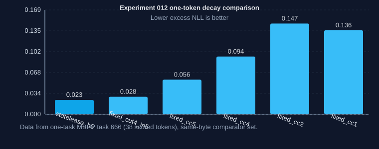

# Experiment 012 Stage-A result: StateLease-H5 survives falsification screen

> **Status: all frozen Stage-A checks passed on the one-task falsification screen.**
>
> StateLease-H5 beats the strongest fixed-replay comparator by a small but
> meaningful margin under the same byte contract on MBPP task `666`, and it
> preserves the full authenticated repository and runtime provenance required by the
> protocol. This is not held-out confirmation, a speed claim, deployment claim,
> or novelty claim.

Date recorded: 2026-07-31

The immutable artifact and strengthened post-result audit are documented in:

- `artifacts/experiment012-statelease-stage-a-666.json`
- `research/EXPERIMENT_012_STATELEASE_PROTOCOL.md`
- `research/EXPERIMENT_012_STAGE_A_IDENTITY.md`
- `artifacts/experiment012-statelease-stage-a-666.attempt.json`

I also keep the full attempt history and pre-existing administrative records from
Experiments 010 and 011 in:

- `evidence/experiment010-statelease-stage-a-administrative-null.json`
- `evidence/experiment011-statelease-stage-a-administrative-null.json`

## Authenticated artifact

| Field | Value |
| --- | --- |
| Artifact | `artifacts/experiment012-statelease-stage-a-666.json` |
| Artifact kind | `recurquant_experiment012_statelease_stage_a_falsification` |
| Clean H0 commit | `c3999c8ff7cc25b02a70da98b0d8faba388d3319` |
| One-run seal commit | `eeeab4b8d5962066e225ea856e83a5ccc24b7dfb` |
| Canonical evidence SHA-256 | `d4bd2c89bb265e5e1dab81a7bf89d97e71fa4a6822bef5d56142428e16b897c1` |
| Output file SHA-256 | `1e92b0bea176154496c7d5e45013bf051ef3f388352c1267d86910f81844fd22` |
| Output created at (UTC) | `2026-07-31T01:05:28.131816+00:00` |
| One-run marker | `RecurQuant-One-Run: experiment012-stage-a-task666-v1` |
| Model | `Qwen/Qwen3.5-0.8B-Base` revision `dc7cdfe2ee4154fa7e30f5b51ca41bfa40174e68` |
| Device and dtype | CUDA, bf16 (`torch.bfloat16`) |
| Task identity | MBPP task `666`, 69 prompt tokens, 39 code tokens, 38 scored tokens |
| Task-row SHA-256 | `b4f5989005c921c3ab94ab52c8115e79f99a22390bc1d6e6235d36fd02687fb9` |
| Stage-0 artifact | `artifacts/experiment012_stage0_production.pt` |
| Stage-0 artifact SHA-256 | `b6d40f126b9fca7578f3dd36d3bf26deeb20e81d270d3b1114dc9e27fd4a3551` |
| Forward passes | 429 |

## Frozen method set and screen rule

StateLease-H5 was evaluated as:

- equal-byte no-replay: `expanded_rht_q4_q8`, `rht_q4_q6_q8`, `rht_residual_q4`
- fixed-replay: `fixed_cc1`, `fixed_cc2`, `fixed_cc4`, `fixed_cc5`, `fixed_cut4_in5`
- historical anchor: `rht_cqer32`
- state lease candidate: `statelease_h5`

The one-shot gate required all candidates to be exact-byte-comparable,
falsification-safe, and pre-specified under the fixed protocol.

## Frozen one-task screen result

| Method | Excess NLL (38 tokens) | Top-1 agreement | Mean KL | CVaR95 KL | Max KL |
| --- | ---: | ---: | ---: | ---: | ---: |
| `statelease_h5` | `0.023349` | `0.947368` | `0.027658` | `0.193988` | `0.267577` |
| `fixed_cut4_in5` | `0.028442` | `0.947368` | `0.030580` | `0.225663` | `0.323064` |
| `fixed_cc5` | `0.056124` | `0.947368` | `0.021947` | `0.076099` | `0.076178` |
| `fixed_cc4` | `0.093655` | `0.947368` | `0.077519` | `0.833122` | `0.960356` |
| `fixed_cc2` | `0.147195` | `0.947368` | `0.059956` | `0.392832` | `0.505890` |
| `fixed_cc1` | `0.136328` | `0.868421` | `0.154371` | `1.022590` | `1.397867` |
| `rht_cqer32` | `0.136328` | `0.868421` | `0.154371` | `1.022590` | `1.397867` |

StateLease-H5 is `82.87%` lower on excess NLL than both `fixed_cc1` and
`rht_cqer32`, and it is `17.90%` better than the strongest fixed comparator
in the gate definition.

## Exact physical contract

StateLease-H5 and every fixed comparator share the same stateful budget:

- 3,454,664 persistent recurrent-state bytes for StateLease payload + query/EMA
  state
- 18,874,368 full FP32 recurrent-state bytes as the exact reference
- 2,564,096 shared recurrent-state payload bytes
- 2,485,760 q4/q8 payload bytes
- 73,728 FP16 scales bytes
- 4,608 precision masks
- 147,456 FP32 query-EMA selector bytes
- 289,032 of 743,112 replay-capacity bytes occupied during the one-task run
- 5.857109917534722 bits per state element

## Integrity and gate checks

All nine frozen Stage-A checks passed:

- exact allocation:
  `3454664` candidate persistent bytes vs `3454664` expected
- `fixed_cc1` improvement threshold:
  statelease excess NLL was `0.136327` lower than `fixed_cc1` by `82.87%`
- top-1 agreement:
  StateLease `0.947368` tied with best fixed comparator (`fixed_cc2`) and
  trail `0.0` with a `0.01` ceiling
- strongest-fixed disadvantage:
  relative disadvantage `-0.1790` (statelease better)
- trajectory-nmse:
  StateLease AUC `0.019805` < `fixed_cc1` AUC `0.050699`

The artifact was published in one monotonic two-phase step and no replay or
rerun occurred.

## Decision

This is a successful one-task falsification screen. It is permission for the next
administratively frozen research step, not held-out confirmation and not a
deployment, novelty, speed, or breakthrough result.

## Limitations

- This is a synthetic teacher-forced token stream (1 task, 38 scored tokens).
- The Stage-A pass does not establish cross-window, multi-seed, cross-code,
  latency, or speed claims.
- The repository still has no fused packed dequant kernel in this pass; inference
  is still pure Python dequantization during recurrent-state updates.
